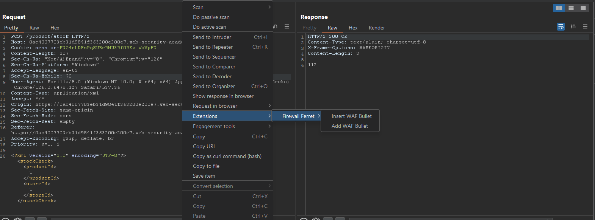

# Firewall Ferret
This java project was created with Portswigger's Montoya API to be a 
Burp Extension. It's well known that WAFs only scan up to a certain amount of data
per request. This extension allows a tester to manually insert junk data and 
adds junk data to Active Scans by duplicating each scan check. 

## Functionalities

This extension provides a few functionalities.
1. The option to insert a bullet of X Kilobyte
2. The option to allow the extension to add a parameter of bullet of X Kilobyte
   1. The following requests are supported: URL-Encoded Body, JSON, XML, Multipart
   2. The following requests are a work in progress: AMF
   3. If the request's content type of unknown to Burp, then the extension will 
   append the entire body with a bullet.
3. Adds a check for every burp active scan check. The check will take the standard
payload and prepend a bullet of the following sizes: `8, 16, 32, 64, 128, 1024`. 
This should lead to better scan results since most applications have WAFs in front.

## Common WAF Limits
| WAF Provider          | Maximum Request Body Inspection Size Limit             |
|-----------------------|--------------------------------------------------------|
| Radware AppWall       | up to 1 GB for cloud WAF                               |
| Cloudflare            | 128 KB for ruleset engine, up to 500 MB for enterprise |
| Fortiweb by Fortinet  | 128 MB                                                 |
| F5 BIG-IP WAAP        | 20 MB (configurable)                                   |
| Sucuri                | 8 MB                                                   |
| Palo Alto             | 8 MB                                                   |
| Akamai                | 8 KB - 128 KB                                          |
| Cloud Armor by Google | 8 KB (can be increased to 128 KB)                      |
| Azure WAF             | 128 KB - 4MB                                           |
| Barracuda WAF         | 64 KB                                                  |
| AWS WAF               | 8 KB - 64 KB (configurable depending on service)       |

## How add manually extension to Burp Suite

1. Download latest release here
2. Open the Extensions tab in Burp Suite
3. Click Add and then add the extension as a java extension
4. Close pop-up

## How to install extension from Burp Suite BAPP store
_Not yet available_
1. Open the Extensions tab in Burp Suite
2. Click BAPP store
3. Search for `Firewall Ferret`
4. Click Install